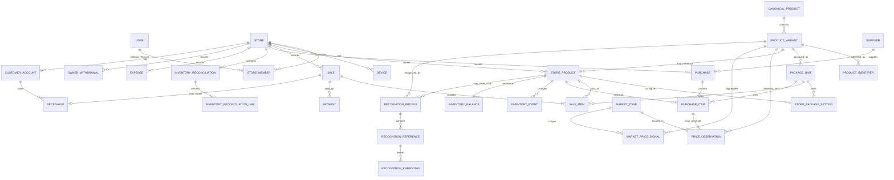

# DOMAIN_DATA_MODEL — Retail Commerce Intelligence

**Version:** 1.0  
**Status:** Architecture source of truth  
**Purpose:** Define the business entities, relationships, invariants, and data ownership rules that implementation must preserve.

---

# 1. Scope

This document defines the logical domain model for the MVP.

It answers:

- What entities exist?
- Which data belongs to the platform versus a store?
- How are products, variants, package units, sales, purchases, inventory, prices and recognition connected?
- Which records are historical/auditable?
- Which values may be derived?
- Which rules must never be violated by implementation?

This document does **not** choose:
- the cloud database vendor;
- the local database library;
- sync transport;
- API framework;
- ORM;
- state-management library.

Those belong in the Technical Architecture and Offline Sync documents.

---

# 2. Domain Principles

## 2.1 Store isolation

Every store-owned commercial record must belong to a specific `storeId`.

A user may belong to more than one store later, but store data must remain isolated unless an explicit cross-store/platform feature is designed.

## 2.2 Shared identity is not store truth

Platform/shared product identity is different from retailer-specific commercial information.

Shared product data may describe:
- product name;
- brand;
- size;
- barcode;
- packaging presentation;
- visual identity.

Store data owns:
- selling price;
- cost;
- stock;
- supplier relationship;
- reorder level;
- active/inactive state.

A platform product update must never overwrite store-specific commercial data.

## 2.3 Inventory is event-based

Stock changes are represented by `InventoryEvent` records.

Do not silently rewrite stock history.

## 2.4 Transactions preserve historical truth

A later product-price or cost change must not alter the historical financial meaning of an already completed sale or purchase.

Important transaction values must therefore be snapshotted on transaction lines.

## 2.5 Offline-safe identifiers

Records created offline require globally unique IDs generated on-device before synchronization.

The implementation may use UUIDv7, ULID, or another architecture-approved globally unique ID scheme.

## 2.6 Explicit corrections

Completed financial/inventory transactions should not be destructively rewritten where an auditable correction can be created instead.

## 2.7 Unknown and incomplete data are valid states

Progressive catalogue creation means some fields can legitimately be unknown.

Do not force fake data merely to satisfy a schema.

---

# 3. High-Level Domain Map

```text
User
  ↓
StoreMember ──────────────── Store ───────────── Device
                               │
                               ├── StoreProduct ───── ProductVariant
                               │        │                    │
                               │        │                    ├── ProductIdentifier
                               │        │                    └── PackageUnit
                               │        │
                               │        ├── SaleItem
                               │        ├── PurchaseItem
                               │        ├── InventoryEvent
                               │        └── RecognitionProfile
                               │
                               ├── Sale ───────── SaleItem
                               │   └───────────── Payment
                               │
                               ├── Purchase ───── PurchaseItem
                               │
                               ├── Expense
                               ├── OwnerWithdrawal
                               ├── InventoryReconciliation
                               ├── PriceObservation
                               └── Supplier

ProductVariant
  └── RecognitionProfile
        └── RecognitionReference
              └── RecognitionEmbedding
```

---

# 4. Identity and Access

## 4.1 User

Represents a human account.

### Core fields

- `id`
- `displayName`
- `email?`
- `phone?`
- `status`
- `createdAt`
- `updatedAt`

### Notes

Authentication credentials/tokens should normally be owned by the chosen authentication provider, not duplicated unnecessarily in the business database.

---

## 4.2 Store

Represents one business/store operating unit.

### Core fields

- `id`
- `name`
- `currencyCode`
- `countryCode`
- `stateRegion?`
- `city?`
- `marketZoneId?`
- `timezone`
- `status`
- `createdByUserId`
- `createdAt`
- `updatedAt`

### MVP assumptions

- One store is one primary inventory/business operating unit.
- Multi-branch management is future scope unless explicitly added later.

---

## 4.3 StoreMember

Links a `User` to a `Store`.

### Core fields

- `id`
- `storeId`
- `userId`
- `role`
- `status`
- `joinedAt`
- `createdAt`
- `updatedAt`

### Initial roles

- `OWNER`
- `ADMIN`
- `STAFF`

### Principle

Detailed permissions should be derived from role/permission rules rather than scattering ad hoc checks throughout the application.

---

## 4.4 Device

Represents an authorized application installation/device participating in offline operation and sync.

### Core fields

- `id`
- `storeId`
- `userId?`
- `platform`
- `deviceLabel?`
- `appVersion`
- `lastSeenAt`
- `status`
- `createdAt`

### Purpose

Supports:
- auditability;
- sync identity;
- debugging;
- authorized-device management;
- multi-device conflict handling.

Detailed sync metadata belongs in `OFFLINE_SYNC.md`.

---

# 5. Product Domain

## 5.1 CanonicalProduct

Represents the broad shared product identity.

Example:

> Milo

or, depending on catalog normalization:

> Milo Chocolate Malt Drink

### Core fields

- `id`
- `canonicalName`
- `brandId?`
- `categoryId?`
- `manufacturerName?`
- `status`
- `createdAt`
- `updatedAt`

### Notes

A canonical product is not sufficient for inventory.

Inventory requires a sellable/purchasable `ProductVariant`.

---

## 5.2 ProductVariant

Represents a commercially distinct physical variant.

Examples:

- Milo 400g
- Milo 800g
- Indomie Chicken 70g
- Peak Milk 400g tin

### Core fields

- `id`
- `canonicalProductId?`
- `identityScope` (`STORE_LOCAL` or `PLATFORM`)
- `ownerStoreId?` (required only for `STORE_LOCAL`)
- `name`
- `brandId?`
- `categoryId?`
- `sizeValue?`
- `sizeUnit?`
- `description?`
- `countryMarket?`
- `packagingGeneration?`
- `status`
- `createdAt`
- `updatedAt`

### Invariant

Different physical sizes or commercially distinct formulations must use different `ProductVariant` records.

A temporary catalogue entry uses a `STORE_LOCAL` provisional variant owned by
the store. Platform variants are shared identities and must not carry an owning
store. Promoting or matching a provisional variant is an explicit operation;
it must not overwrite store-owned commercial data or rewrite transaction
snapshots. See D-035.

Example:

> Milo 400g ≠ Milo 800g.

---

## 5.3 ProductIdentifier

Represents an externally observable identifier.

### Core fields

- `id`
- `productVariantId`
- `packageUnitId?`
- `type`
- `value`
- `countryMarket?`
- `status`
- `createdAt`

### Identifier types

Examples:
- `EAN`
- `UPC`
- `QR`
- `INTERNAL_CODE`
- `MANUFACTURER_CODE`

### Important rule

An identifier may refer to a specific package presentation.

Example:

A carton barcode may map to:

- `productVariantId = Indomie Chicken 70g`
- `packageUnitId = carton`

while the sachet barcode may map to the same variant with another package unit.

---

## 5.4 PackageUnit

Represents a configured quantity of one `ProductVariant`.

Examples:
- sachet
- bottle
- piece
- pack
- carton
- blister
- tablet

### Core fields

- `id`
- `productVariantId`
- `name`
- `symbol?`
- `conversionToBaseMicros`
- `isBaseUnit`
- `isSellable`
- `isPurchasable`
- `status`
- `createdAt`
- `updatedAt`

### Example

For Indomie Chicken 70g:

| Unit | conversionToBase |
|---|---:|
| sachet | 1 |
| pack | 10 |
| carton | 40 |

### Invariants

For each `ProductVariant`:

1. Exactly one active base inventory unit should exist.
2. Base unit has `conversionToBaseMicros = 1,000,000` (one base unit).
3. Conversion factor must be positive.
4. Package conversions must not change historical completed transactions.

Authoritative quantities and conversion factors use the fixed six-decimal
micro-unit representation in D-034. Decimal input is parsed exactly; operations
that require hidden rounding or exceed the safe persisted range are rejected.

If a manufacturer changes carton composition in the future, create/version the relevant package definition rather than retroactively altering old transaction meaning.

---

## 5.5 StoreProduct

Represents a product variant carried by one store.

### Core fields

- `id`
- `storeId`
- `productVariantId`
- `localSku?`
- `preferredPackageUnitId?`
- `defaultSellingPrice?`
- `minimumSellingPrice?`
- `reorderLevelBaseUnits?`
- `isTemporary`
- `status`
- `createdAt`
- `updatedAt`

### Important notes

A temporary `StoreProduct` links to a store-scoped provisional ProductVariant,
not directly to a platform identity. Its `isTemporary` flag records that the
identity needs enrichment or explicit matching. This preserves progressive
creation while ensuring every product has a base PackageUnit. See D-035.

### Store-owned data

The following should remain store-owned:
- default selling price;
- minimum selling price;
- stock;
- reorder level;
- preferred supplier;
- local SKU;
- active/inactive status.

---

## 5.6 StorePackageSetting

Stores store-specific behavior for a particular package unit.

### Core fields

- `id`
- `storeProductId`
- `packageUnitId`
- `defaultSellingPrice?`
- `minimumSellingPrice?`
- `isPreferredForSale`
- `isPreferredForPurchase`
- `createdAt`
- `updatedAt`

### Why this exists

The same package definition can exist globally while each retailer chooses its own selling price.

---

# 6. Supplier Domain

## 6.1 Supplier

Represents a retailer-defined supplier/wholesaler/vendor.

### Core fields

- `id`
- `storeId`
- `name`
- `phone?`
- `address?`
- `notes?`
- `status`
- `createdAt`
- `updatedAt`

### Principle

Supplier relationships are private store data unless explicitly shared with consent through a later platform feature.

---

# 7. Sales Domain

## 7.1 Sale

Represents one completed or pending customer transaction.

### Core fields

- `id`
- `storeId`
- `status`
- `subtotal`
- `discountTotal`
- `total`
- `currencyCode`
- `occurredAt`
- `createdByStoreMemberId`
- `deviceId`
- `createdAt`
- `completedAt?`

### Suggested statuses

- `DRAFT`
- `COMPLETED`
- `VOIDED`

### Important rule

A completed sale must be durably stored locally before the UI reports success.

---

## 7.2 SaleItem

Represents one line of a sale.

### Core fields

- `id`
- `saleId`
- `storeProductId`
- `productVariantId?`
- `packageUnitId`
- `quantityPackages`
- `conversionToBaseSnapshot`
- `quantityBaseUnits`
- `unitSellingPrice`
- `discountAmount`
- `lineTotal`
- `unitCostBaseSnapshot?`
- `cogsAmount?`
- `productNameSnapshot`
- `packageNameSnapshot`
- `createdAt`

### Why snapshots matter

If the retailer changes:
- selling price;
- product name;
- package conversion;
- average cost;

the old sale must still represent what actually happened at the time.

### Example

Sale:
- 2 packs
- each pack = 10 sachets

Store:

- `quantityPackages = 2`
- `conversionToBaseSnapshot = 10`
- `quantityBaseUnits = 20`

Inventory decreases by 20 base units.

---

## 7.3 Payment

Represents payment received against a sale.

### Core fields

- `id`
- `saleId`
- `method`
- `amount`
- `occurredAt`
- `reference?`
- `createdAt`

### Initial methods

- `CASH`
- `BANK_TRANSFER`
- `POS_CARD`
- `CREDIT`

### Design note

Even if the MVP UI initially asks for one payment method, using a separate Payment entity leaves room for:
- split payments;
- later partial credit settlement;
- corrections.

---

# 8. Credit Sales Domain

## 8.1 CustomerAccount

Lightweight optional customer identity for credit tracking.

### Core fields

- `id`
- `storeId`
- `name`
- `phone?`
- `notes?`
- `createdAt`
- `updatedAt`

### Non-goal

This is not a full CRM.

---

## 8.2 Receivable

Represents money still owed from a credit sale.

### Core fields

- `id`
- `storeId`
- `saleId`
- `customerAccountId?`
- `originalAmount`
- `outstandingAmount`
- `status`
- `dueDate?`
- `createdAt`
- `updatedAt`

### Statuses

- `OPEN`
- `PARTIALLY_PAID`
- `PAID`
- `WRITTEN_OFF`

Further debt-collection functionality is outside MVP.

---

# 9. Purchase / Restocking Domain

## 9.1 Purchase

Represents a restocking/purchase transaction.

### Core fields

- `id`
- `storeId`
- `supplierId?`
- `status`
- `totalAmount?`
- `currencyCode`
- `occurredAt`
- `createdByStoreMemberId`
- `deviceId`
- `createdAt`
- `completedAt?`

### Suggested statuses

- `DRAFT`
- `COMPLETED`
- `VOIDED`

---

## 9.2 PurchaseItem

Represents one purchased/restocked product line.

### Core fields

- `id`
- `purchaseId`
- `storeProductId`
- `productVariantId?`
- `packageUnitId`
- `quantityPackages`
- `conversionToBaseSnapshot`
- `quantityBaseUnits`
- `packagePurchaseCost`
- `totalPurchaseCost`
- `unitCostBaseDerived`
- `productNameSnapshot`
- `packageNameSnapshot`
- `createdAt`

### Example

Purchase:
- 5 cartons;
- carton conversion = 40 sachets;
- total cost = ₦60,000.

Derived:
- 200 base units;
- ₦300/base unit.

### Important rule

The original package-basis price must be retained even when normalized base-unit cost is derived.

This is important for restock-price intelligence.

---

# 10. Inventory Domain

## 10.1 InventoryEvent

Append-oriented record representing a stock change.

### Core fields

- `id`
- `storeId`
- `storeProductId`
- `eventType`
- `quantityBaseDelta`
- `packageUnitId?`
- `quantityPackageSnapshot?`
- `conversionToBaseSnapshot?`
- `sourceType`
- `sourceId?`
- `reasonCode?`
- `note?`
- `occurredAt`
- `createdByStoreMemberId`
- `deviceId`
- `createdAt`

### Event types

Examples:
- `PURCHASE`
- `SALE`
- `CUSTOMER_RETURN`
- `SUPPLIER_RETURN`
- `DAMAGED`
- `EXPIRED`
- `MISSING`
- `PERSONAL_USE`
- `CORRECTION`
- `OPENING_BALANCE`

### Sign convention

- positive delta = stock enters
- negative delta = stock leaves

### Invariant

Every stock-changing completed transaction must produce the appropriate inventory event(s).

---

## 10.2 InventoryBalance

A derived/optimized balance for fast application queries.

### Core fields

- `storeProductId`
- `quantityBaseUnits`
- `updatedAt`
- `lastInventoryEventId?`

### Important rule

`InventoryEvent` history remains the auditable basis.

`InventoryBalance` is a performance/read-model convenience and must be reconstructable from valid inventory events.

---

## 10.3 InventoryReconciliation

Represents one physical stock-check session.

### Core fields

- `id`
- `storeId`
- `status`
- `startedAt`
- `completedAt?`
- `createdByStoreMemberId`
- `deviceId`
- `createdAt`

### Statuses

- `IN_PROGRESS`
- `COMPLETED`
- `CANCELLED`

---

## 10.4 InventoryReconciliationLine

Represents one checked product.

### Core fields

- `id`
- `reconciliationId`
- `storeProductId`
- `recordedBaseUnitsSnapshot`
- `physicalBaseUnits`
- `differenceBaseUnits`
- `reasonCode?`
- `note?`
- `adjustmentInventoryEventId?`
- `createdAt`

### Invariant

If reconciliation changes stock, it creates an explicit `InventoryEvent`.

Do not overwrite the balance without an adjustment event.

---

# 11. Costing Domain

## 11.1 StoreProductCostState

Maintains the current costing state for a store product.

### Core fields

- `storeProductId`
- `method`
- `averageUnitCostBase?`
- `quantityCostedBaseUnits?`
- `updatedAt`

### Initial method candidate

- `MOVING_WEIGHTED_AVERAGE`

### Important rules

1. Purchase/restock may update current average cost.
2. Completed sales snapshot the cost used at transaction time.
3. Future cost changes must not alter historical COGS.

### Accounting note

The exact accounting behavior must be validated before formal accounting claims are made.

---

# 12. Expense and Withdrawal Domain

## 12.1 Expense

Represents business operating money spent outside inventory purchases.

### Core fields

- `id`
- `storeId`
- `category`
- `amount`
- `currencyCode`
- `note?`
- `occurredAt`
- `createdByStoreMemberId`
- `deviceId`
- `createdAt`

### Initial categories

- `TRANSPORT`
- `WAGES`
- `FUEL_ELECTRICITY`
- `RENT`
- `MAINTENANCE`
- `LEVIES_TAX`
- `MISCELLANEOUS`

---

## 12.2 OwnerWithdrawal

Represents business money removed for owner/personal use.

### Core fields

- `id`
- `storeId`
- `amount`
- `currencyCode`
- `note?`
- `occurredAt`
- `createdByStoreMemberId`
- `deviceId`
- `createdAt`

### Invariant

Owner withdrawal must remain distinct from ordinary operating expense.

---

# 13. Price Intelligence Domain

## 13.1 PriceObservation

Represents one observed product purchase/restock price.

### Core fields

- `id`
- `storeId?`
- `productVariantId`
- `packageUnitId`
- `observedPrice`
- `currencyCode`
- `quantityBasis`
- `normalizedBaseUnitPrice?`
- `sourceType`
- `sourceReferenceId?`
- `supplierId?`
- `marketZoneId?`
- `observedAt`
- `validationStatus`
- `confidence?`
- `contributionConsent`
- `createdAt`

### Source types

Examples:
- `RETAILER_PURCHASE`
- `MANUAL_MARKET_CHECK`
- `WHOLESALER_QUOTE`
- `SUPPLIER`
- `EXTERNAL_DATASET`

### Important distinction

A retailer's own purchase observation may be private locally while a sanitized/anonymized contribution becomes eligible for platform aggregation.

The implementation should not assume that raw private purchase records are themselves directly exposed as shared network data.

---

## 13.2 MarketPriceSignal

Represents an aggregated market output produced from observations.

This may primarily be a backend/read-model entity rather than a local source-of-truth transaction.

### Core fields

- `id`
- `productVariantId`
- `packageUnitId`
- `marketZoneId`
- `currencyCode`
- `observedMin`
- `observedMax`
- `typicalPrice`
- `trendPercent?`
- `observationCount`
- `confidence`
- `freshnessAt`
- `calculationVersion`
- `createdAt`

### Principle

Do not present one absolute "market price" where observations support only a range or uncertain estimate.

---

# 14. Recognition Domain

## 14.1 RecognitionProfile

Represents the recognition identity/profile for a product or package presentation.

### Core fields

- `id`
- `productVariantId?`
- `storeProductId?`
- `packageUnitId?`
- `scope`
- `status`
- `marketRegion?`
- `packagingGeneration?`
- `provenanceType`
- `createdAt`
- `updatedAt`

### Scope examples

- `STORE_LOCAL`
- `PLATFORM_APPROVED`

### Principle

Store-local recognition can exist before platform canonicalization.

---

## 14.2 RecognitionReference

Represents one approved/reference visual sample or derived reference.

### Core fields

- `id`
- `recognitionProfileId`
- `referenceType`
- `imageAssetId?`
- `thumbnailAssetId?`
- `ocrClues?`
- `viewLabel?`
- `qualityScore?`
- `source`
- `permissionStatus?`
- `capturedAt?`
- `createdAt`

### Reference types

Examples:
- `IMAGE`
- `BARCODE_ASSOCIATION`
- `OCR_REFERENCE`
- `VISUAL_REFERENCE`

---

## 14.3 RecognitionEmbedding

Represents a model-specific vector derived from a recognition reference.

### Core fields

- `id`
- `recognitionReferenceId`
- `embeddingModelId`
- `embeddingModelVersion`
- `preprocessingVersion`
- `vectorData`
- `dimension`
- `createdAt`

### Invariant

Embeddings must be version-aware.

A new recognition model may require regenerating embeddings from retained approved reference assets.

---

## 14.4 RecognitionAttempt

Optional but recommended diagnostic/analytics entity.

Represents a recognition event or final result sufficient for evaluation/debugging.

### Core fields

- `id`
- `storeId`
- `deviceId`
- `method`
- `resultState`
- `selectedStoreProductId?`
- `selectedProductVariantId?`
- `selectedPackageUnitId?`
- `confidence?`
- `wasUserCorrected?`
- `latencyMs?`
- `occurredAt`

### Result states

- `STRONG`
- `AMBIGUOUS`
- `UNKNOWN`

### Privacy principle

Do not retain raw customer/store imagery unnecessarily.

Detailed recognition telemetry/storage rules belong in the scanning architecture and privacy/security architecture.

---

# 15. Asset Domain

## 15.1 MediaAsset

Represents image/file metadata.

### Core fields

- `id`
- `storeId?`
- `ownerType`
- `ownerId`
- `localUri?`
- `remoteObjectKey?`
- `mimeType`
- `sizeBytes?`
- `width?`
- `height?`
- `checksum?`
- `syncStatus?`
- `createdAt`

### Purpose

Can support:
- product images;
- compressed recognition references;
- thumbnails;
- future invoice/evidence images.

Do not store large image blobs directly in normal relational transaction rows unless architecture explicitly justifies it.

---

# 16. Market / Geography Domain

## 16.1 MarketZone

Represents the geographic scope used for price intelligence.

### Core fields

- `id`
- `name`
- `city`
- `stateRegion`
- `countryCode`
- `parentZoneId?`
- `status`

### Principle

Price relevance should be tied to meaningful geographic zones rather than assuming nationwide equivalence.

---

# 17. Audit and Correction Rules

## 17.1 Completed sale

If a completed sale is wrong:
- void/reverse according to approved rules;
- create compensating inventory/financial effects;
- preserve original record.

## 17.2 Completed purchase

If a completed purchase is wrong:
- correct through an explicit approved correction/void workflow;
- preserve history;
- adjust inventory/cost effects transparently.

## 17.3 Inventory correction

Always create an `InventoryEvent`.

## 17.4 Shared product identity correction

Canonical product metadata may be corrected/versioned without rewriting the historical transaction snapshots stored on sales/purchases.

---

# 18. Derived Values

The following values should generally be derived or treated as read models rather than independent sources of truth:

- current inventory quantity;
- today's sales total;
- transaction count;
- tracked gross margin;
- top-selling products;
- latest purchase price;
- restock-price change;
- market-price trend;
- low-stock status.

Derived values may be cached for performance but must remain reconstructable from authoritative underlying records.

---

# 19. Important Domain Invariants

Implementation must preserve these rules.

## Product / package

1. One product variant has exactly one active base unit.
2. Package conversion factors are positive.
3. Completed transaction lines preserve conversion snapshots.
4. Different physical sizes are different product variants.
5. Store selling prices are not overwritten by platform product updates.

## Sales

6. Completed sale totals must equal the validated sum of their line/payment rules.
7. Completed sale items preserve selling-price and cost snapshots.
8. Completed sales generate inventory effects exactly once.

## Purchases

9. Completed purchase items preserve package-basis purchase cost.
10. Completed purchases generate inventory effects exactly once.
11. Restocking updates personal purchase-price history.

## Inventory

12. Stock changes must have inventory-event provenance.
13. Reconciliation differences create explicit adjustment events.
14. Derived inventory balance must be reconstructable.

## Financial

15. Owner withdrawal is distinct from operating expense.
16. Tracked gross margin must not be presented as full net profit when required data is missing.

## Price network

17. Shared market intelligence must preserve source/provenance metadata.
18. Private retailer identity must not be exposed through ordinary price-network output.
19. Price contribution must respect consent.

## Recognition

20. Recognition must support `UNKNOWN`.
21. Store-local recognition data may exist independently of platform canonical data.
22. Recognition/profile updates must not overwrite commercial store data.
23. Model-derived embeddings must carry model/preprocessing versions.
24. Recognition failure must not block transaction completion.

## Offline/sync

25. Device-created IDs must remain globally unique.
26. Synchronization retries must not create duplicate business transactions.
27. Local completed transactions must survive app restart before cloud synchronization.

---

# 20. Suggested Entity Relationship Diagram



---

# 21. Data That Must Be Snapshotted

At transaction time, do not depend solely on mutable linked records.

Snapshot where needed:

## SaleItem
- product display name;
- package name;
- package conversion;
- selling price;
- cost basis used.

## PurchaseItem
- product display name;
- package name;
- package conversion;
- purchase price/cost.

Why:

If product metadata changes later, historical receipts, inventory movements and financial calculations remain correct.

---

# 22. Data Ownership Classification

## Platform/shared data

Examples:
- canonical products;
- shared product variants;
- approved identifiers;
- approved recognition profiles;
- market zones;
- aggregated market-price signals.

## Store-private data

Examples:
- sales;
- purchases;
- stock;
- expenses;
- withdrawals;
- suppliers;
- staff activity;
- local prices;
- local SKU;
- private purchase history;
- local recognition references unless explicitly shared.

## Derived/aggregated network data

Examples:
- anonymized price observations;
- market ranges;
- trends;
- confidence;
- observation counts.

A later security/privacy specification must enforce this separation technically.

---

# 23. Deletion / Deactivation Principle

Business-history entities should generally prefer:
- status;
- void/reversal;
- archival/deactivation;

over destructive deletion.

Examples:
- a discontinued `StoreProduct` becomes inactive;
- a staff member can be deactivated;
- a canonical product can be superseded/merged;
- a completed sale is voided/reversed rather than erased.

Exact retention rules belong in the security/data-retention architecture.

---

# 24. MVP Entities — Required vs Deferred

## Required for core MVP

- User
- Store
- StoreMember
- Device
- ProductVariant
- PackageUnit
- StoreProduct
- StorePackageSetting
- ProductIdentifier
- Sale
- SaleItem
- Payment
- Purchase
- PurchaseItem
- InventoryEvent
- InventoryBalance
- InventoryReconciliation
- InventoryReconciliationLine
- StoreProductCostState
- Expense
- OwnerWithdrawal
- Supplier
- PriceObservation
- MediaAsset

## Required for scanner track

- RecognitionProfile
- RecognitionReference
- RecognitionEmbedding
- RecognitionAttempt or equivalent test telemetry

## May be staged later in MVP/beta

- CanonicalProduct if initial catalog begins store-local
- CustomerAccount
- Receivable
- MarketPriceSignal local persistence
- advanced category/brand tables
- richer staff permissions

---

# 25. Open Questions for Technical Architecture

The domain model intentionally does not yet decide:

1. UUIDv7 vs ULID vs another ID scheme.
2. Exact local SQL schema and indexes.
3. ORM/query layer.
4. Whether platform product catalog starts fully canonical or allows provisional identities first.
5. Exact multi-device ownership model.
6. Exact sync metadata/change-log structure.
7. Whether `InventoryBalance` is a table, materialized view, or application-maintained projection.
8. Exact void/reversal transaction design.
9. Exact credit-sale settlement model.
10. Exact image-storage lifecycle.
11. Exact price-observation anonymization pipeline.
12. Exact recognition vector storage representation.
13. Exact schema/version migration system.
14. Exact accounting treatment for weighted-average costing.

These are inputs to `TECHNICAL_ARCHITECTURE.md` and `OFFLINE_SYNC.md`.

---

# 26. Source-of-Truth Relationship

This document must be read with:

- `PRODUCT_INCEPTION.md`
- `PRD_MVP.md`
- `TECHNICAL_ARCHITECTURE.md`
- `OFFLINE_SYNC.md`
- `SCANNING_ARCHITECTURE.md`
- `BUILD_PLAN.md`

If the active AI coding agent proposes a schema that violates the domain invariants in this document, it must flag the conflict before implementation.

Schema migrations must not silently change the business meaning of existing data.

---

# 27. Implementation Principle

The physical database schema may differ from this logical model for performance or implementation reasons.

That is acceptable only if the architecture preserves the same business meaning and invariants.

the active AI coding agent is allowed to recommend:
- splitting entities;
- combining implementation tables;
- adding indexes;
- adding projections/read models;
- adding sync/internal metadata;

but must explain any material departure from this logical model before changing the source-of-truth architecture.
